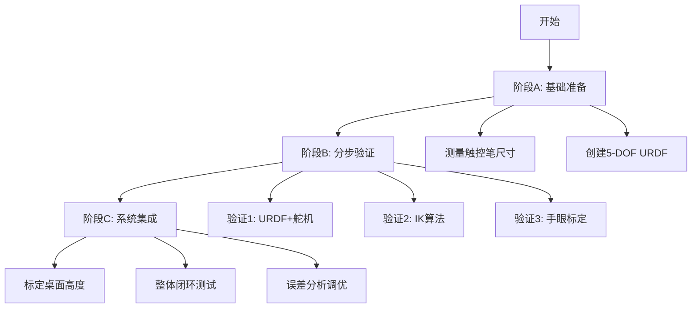
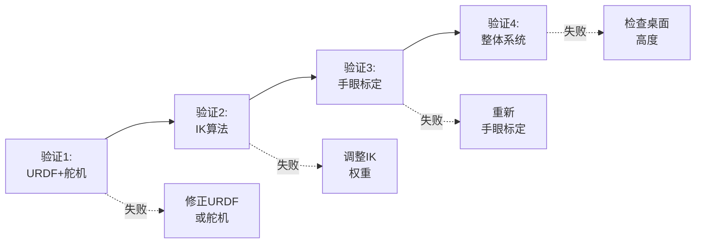

# 第一阶段：精确到达相机视野中心点（完整实施计划）

## 项目背景

- **硬件改造**：SO101从6-DOF改为5-DOF（去掉gripper关节，保留wrist_roll）
- **末端执行器**：3D打印触控笔套 + 触控笔
- **相机**：普通RGB相机（无深度），安装在龙门架上
- **目标精度**：< 1cm 定位误差

---

## 总体流程



---

## 阶段A: 基础准备

### A1. 测量触控笔套尺寸

**目标**：获取从`wrist_roll`舵机盘中心到触控笔尖端的精确偏移量

**测量内容**：

- **X偏移**（前后方向）：______ mm
- **Y偏移**（左右方向）：______ mm
- **Z偏移**（竖直方向）：______ mm

**工具**：游标卡尺

**输出**：创建 `stylus_measurements.txt` 保存测量值

**示例**：

```
X: 0.000 m (舵机盘中心对齐)
Y: 0.000 m
Z: 0.085 m (触控笔伸出85mm)
```

---

### A2. 创建5-DOF机器人URDF

**文件**：`SO101/so101_5dof_stylus.urdf`

**基于**：[`SO101/so101_new_calib.urdf`](SO101/so101_new_calib.urdf)

**修改步骤**：

1. **复制原文件**
   ```bash
   cp SO101/so101_new_calib.urdf SO101/so101_5dof_stylus.urdf
   ```

2. **删除gripper关节**（搜索 `<joint name="gripper"`，删除整个joint定义）

3. **删除moving_jaw_so101_v1_link**（搜索并删除）

4. **在gripper_link后添加触控笔**
   ```xml
   <!-- Stylus holder joint (fixed to wrist_roll output) -->
   <joint name="stylus_joint" type="fixed">
     <parent link="gripper_link"/>
     <child link="stylus_tip_link"/>
     <origin xyz="0.000 0.000 0.085" rpy="0 0 0"/>
     <!-- xyz使用A1步骤的测量值 -->
   </joint>
   
   <!-- Stylus tip link (end-effector reference point) -->
   <link name="stylus_tip_link">
     <inertial>
       <mass value="0.01"/>  <!-- 不影响IK，示例值即可 -->
       <inertia ixx="0.0001" ixy="0" ixz="0" 
                iyy="0.0001" iyz="0" izz="0.0001"/>
     </inertial>
     <visual>
       <geometry>
         <cylinder radius="0.005" length="0.08"/>
       </geometry>
       <material name="stylus_gray">
         <color rgba="0.5 0.5 0.5 1"/>
       </material>
     </visual>
   </link>
   ```


**说明**：

- `inertial`（惯性参数）：仅用于动力学仿真，**IK/FK不使用**，示例值即可
- `visual`（可视化）：仅用于仿真器显示，**不影响运动学计算**

---

## 阶段B: 分步验证（误差解耦）

**目的**：逐一验证每个环节，定位误差来源



---

### B1. 验证URDF模型 + 舵机执行精度

**目的**：验证机械臂本身的精度，不涉及相机和IK

**脚本**：`test_urdf_and_motor_accuracy.py`（新建）

**流程**：

```python
#!/usr/bin/env python3
"""验证URDF模型和舵机执行精度"""

import numpy as np
from lerobot.model.kinematics import RobotKinematics
from lerobot.robots.so101 import SO101Robot

# 初始化
kinematics = RobotKinematics(
    urdf_path="SO101/so101_5dof_stylus.urdf",
    target_frame_name="stylus_tip_link",
    joint_names=["shoulder_pan", "shoulder_lift", "elbow_flex", 
                 "wrist_flex", "wrist_roll"]
)

robot = SO101Robot()
robot.connect()

print("="*60)
print("URDF模型和舵机精度验证")
print("="*60)

# 测试3-5个不同位置
for i in range(3):
    input(f"\n第{i+1}次测试：请手动移动机械臂到任意位置，按回车继续...")
    
    # 1. 读取关节角度
    joints = robot.get_joint_positions()
    print(f"当前关节角度: {joints[:5]}")
    
    # 2. FK计算理论末端位置
    fk_pose = kinematics.forward_kinematics(joints)
    fk_pos = fk_pose[:3, 3]
    print(f"FK计算位置(米): x={fk_pos[0]:.4f}, y={fk_pos[1]:.4f}, z={fk_pos[2]:.4f}")
    
    # 3. 人工测量实际位置
    print("\n用尺子测量触控笔尖端相对基座的位置：")
    measured_x = float(input("  X(米，前后，向前为正): "))
    measured_y = float(input("  Y(米，左右，向左为正): "))
    measured_z = float(input("  Z(米，上下，向上为正): "))
    measured_pos = np.array([measured_x, measured_y, measured_z])
    
    # 4. 计算误差
    error = np.linalg.norm(fk_pos - measured_pos)
    print(f"\n误差: {error * 1000:.2f} mm")
    
    if error * 1000 > 5:
        print("⚠️  误差较大，可能是URDF参数或触控笔尺寸测量有误")

print("\n" + "="*60)
print("验证完成")
print("="*60)
```

**判断标准**：

- ✅ **误差 < 5mm**：URDF和舵机准确，继续下一步
- ❌ **误差 > 5mm**：
  - 重新测量触控笔套尺寸
  - 检查URDF中的连杆长度是否准确

---

### B2. 验证IK算法收敛精度

**目的**：验证IK求解器的数学精度，不涉及实际运动

**脚本**：`test_ik_convergence.py`（新建）

**流程**：

```python
#!/usr/bin/env python3
"""验证IK算法收敛精度"""

import numpy as np
from scipy.spatial.transform import Rotation as R
from lerobot.model.kinematics import RobotKinematics

kinematics = RobotKinematics(
    urdf_path="SO101/so101_5dof_stylus.urdf",
    target_frame_name="stylus_tip_link",
    joint_names=["shoulder_pan", "shoulder_lift", "elbow_flex", 
                 "wrist_flex", "wrist_roll"]
)

# 测试10个不同位置
test_positions = [
    [0.25, 0.0, 0.1],
    [0.30, -0.1, 0.08],
    [0.30, 0.1, 0.08],
    [0.35, 0.0, 0.05],
    [0.28, -0.05, 0.12],
    [0.32, 0.05, 0.06],
    [0.27, 0.08, 0.10],
    [0.33, -0.08, 0.07],
    [0.29, 0.0, 0.09],
    [0.31, 0.03, 0.11],
]

print("="*60)
print("IK算法收敛精度验证")
print("="*60)

errors = []
for i, target_pos in enumerate(test_positions):
    # 1. 构建目标位姿（竖直向下）
    target_T = np.eye(4)
    target_T[:3, 3] = target_pos
    rot = R.from_euler('y', 180, degrees=True)
    target_T[:3, :3] = rot.as_matrix()
    
    # 2. IK求解
    joints = kinematics.inverse_kinematics(
        current_joint_pos=np.zeros(5),
        desired_ee_pose=target_T,
        position_weight=1.0,
        orientation_weight=0.1
    )
    
    # 3. FK验证
    fk_pose = kinematics.forward_kinematics(joints)
    fk_pos = fk_pose[:3, 3]
    
    # 4. 计算收敛误差
    error = np.linalg.norm(fk_pos - target_pos)
    errors.append(error)
    print(f"目标{i+1} {target_pos} → 误差: {error * 1000:.3f} mm")

print("\n" + "="*60)
print(f"平均IK误差: {np.mean(errors) * 1000:.3f} mm")
print(f"最大IK误差: {np.max(errors) * 1000:.3f} mm")
print("="*60)
```

**判断标准**：

- ✅ **平均误差 < 1mm**：IK算法收敛良好
- ⚠️ **平均误差 1-3mm**：可接受，可能需要调整权重
- ❌ **平均误差 > 3mm**：
  - 降低 `orientation_weight` 到 0.05 或 0.0
  - 5-DOF可能无法完美满足竖直向下的姿态约束

---

### B3. 验证手眼标定精度

**目的**：验证相机坐标系到机器人坐标系的转换

#### B3.1 重新进行手眼标定（使用5-DOF机械臂）

**修改脚本**：[`hand_eye_calibration_opencv.py`](hand_eye_calibration_opencv.py)

找到并修改以下部分：

```python
# 原来可能是：
urdf_path = "SO101/so101_new_calib.urdf"

# 改为：
urdf_path = "SO101/so101_5dof_stylus.urdf"

# 关节名称保持不变（因为5个关节名字相同）
joint_names = ["shoulder_pan", "shoulder_lift", "elbow_flex", 
               "wrist_flex", "wrist_roll"]

# 末端执行器改为触控笔尖端
target_frame_name = "stylus_tip_link"
```

**采集数据**：

```bash
python hand_eye_calibration_opencv.py
```

- 移动机械臂到 **15-20个不同位姿**
- 确保每次棋盘格都被清晰检测到
- 位姿分布要广（不同距离、角度、高度）

**计算标定矩阵**：

```bash
python hand_eye_solver.py
```

输出：`outputs/camera_to_base_calibration.json`

#### B3.2 验证手眼标定质量

**使用**：[`visualize_hand_eye_calibration.py`](visualize_hand_eye_calibration.py)

```bash
python visualize_hand_eye_calibration.py
```

**关键指标**：

```
偏移一致性分析：
  偏移标准差: X.XX mm
```

**判断标准**：

- ✅ **标准差 < 5mm**：手眼标定质量良好
- ⚠️ **标准差 5-10mm**：可用，但可能影响最终精度
- ❌ **标准差 > 10mm**：标定质量差，需要重做
  - 增加采集数量到30-40个位姿
  - **确认棋盘格方格尺寸**（你之前遇到过5mm vs 8.1mm的问题！）
  - 重新标定相机内参

---

## 阶段C: 系统集成与测试

### C1. 标定桌面高度

**目的**：确定桌面在机器人基座坐标系中的z值

**方法：FK直接测量（推荐，简单）**

**脚本**：`calibrate_table_height.py`（新建）

```python
#!/usr/bin/env python3
"""标定桌面高度"""

import numpy as np
import json
from lerobot.model.kinematics import RobotKinematics
from lerobot.robots.so101 import SO101Robot

kinematics = RobotKinematics(
    urdf_path="SO101/so101_5dof_stylus.urdf",
    target_frame_name="stylus_tip_link",
    joint_names=["shoulder_pan", "shoulder_lift", "elbow_flex", 
                 "wrist_flex", "wrist_roll"]
)

robot = SO101Robot()
robot.connect()

print("="*60)
print("桌面高度标定")
print("="*60)
print("\n请手动移动触控笔尖端，使其轻轻接触桌面")
input("调整好后按回车...")

# 读取关节角度
joints = robot.get_joint_positions()

# FK计算末端位置
fk_pose = kinematics.forward_kinematics(joints)
table_height = fk_pose[2, 3]  # z坐标

print(f"\n桌面高度（基座坐标系）: {table_height:.4f} m")

# 保存结果
output = {
    "table_height_base": float(table_height),
    "measurement_method": "direct_fk",
    "unit": "meters"
}

import os
os.makedirs("outputs", exist_ok=True)
with open("outputs/table_height.json", "w") as f:
    json.dump(output, f, indent=2)

print("\n✅ 已保存到 outputs/table_height.json")

# 多次测量验证
print("\n建议多测几次验证一致性：")
for i in range(2):
    input(f"第{i+2}次：重新调整位置后按回车...")
    joints = robot.get_joint_positions()
    fk_pose = kinematics.forward_kinematics(joints)
    h = fk_pose[2, 3]
    print(f"  高度: {h:.4f} m  (差值: {(h - table_height)*1000:.2f} mm)")
```

---

### C2. 相机视野中心点到达测试

**脚本**：`test_camera_center_reach.py`（新建）

**完整代码**：

```python

#!/usr/bin/env python3

"""测试机械臂到达相机视野中心点"""

import numpy as np

import json

import time

from scipy.spatial.transform import Rotation as R

from lerobot.model.kinematics import RobotKinematics

from lerobot.robots.so101 import SO101Robot

# ========== 配置参数 ==========

URDF_PATH = "SO101/so101_5dof_stylus.urdf"

JOINT_NAMES = ["shoulder_pan", "shoulder_lift", "elbow_flex",

"wrist_flex", "wrist_roll"]

TARGET_FRAME = "stylus_tip_link"

POSITION_WEIGHT = 1.0

ORIENTATION_WEIGHT = 0.1  # 可调整

# ==============================

def load_calibration_data():

"""加载标定数据"""

# 相机内参

with open("outputs/cheap_camera_intrinsics.json") as f:

intrinsics = json.load(f)

camera_matrix = np.array(intrinsics["camera_matrix"])

# 手眼标定

with open("outputs/camera_to_base_calibration.json") as f:

hand_eye = json.load(f)

T_cam_to_base = np.array(hand_eye["T_cam_to_base"])

# 桌面高度

with open("outputs/table_height.json") as f:

table_data = json.load(f)

table_height = table_data["table_height_base"]

return camera_matrix, T_cam_to_base, table_height

def compute_camera_center_3d(camera_matrix, T_cam_to_base, table_height):

"""计算相机视野中心对应的3D坐标（在桌面上）"""

# 相机内参

fx = camera_matrix[0, 0]

fy = camera_matrix[1, 1]

cx = camera_matrix[0, 2]

cy = camera_matrix[1, 2]

# 相机在机器人坐标系的位置

camera_pos_base = T_cam_to_base[:3, 3]

# 桌面在相机坐标系的深度

depth_camera