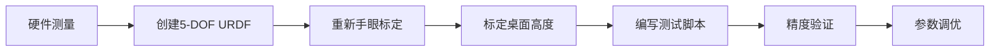
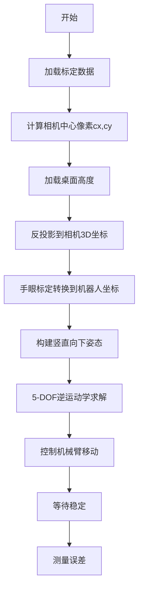

# 第一阶段：精确到达相机视野中心点

## 总体流程



## 实施步骤

### 步骤1: 测量触控笔套尺寸

**目标**: 获取从 `wrist_roll` 舵机盘中心到触控笔尖端的精确偏移量

**测量方法**:

1. 使用游标卡尺测量触控笔套的关键尺寸
2. 需要测量的参数（相对于wrist_roll舵机盘中心）:

   - **X方向偏移** (前后): _______ mm
   - **Y方向偏移** (左右): _______ mm  
   - **Z方向偏移** (竖直): _______ mm（触控笔尖端到舵机盘的距离）

**记录方式**: 创建 `stylus_measurements.txt` 保存测量值

---

### 步骤2: 创建5-DOF机器人URDF

**文件**: [`SO101/so101_5dof_stylus.urdf`](SO101/so101_5dof_stylus.urdf) (新建)

**基于**: [`SO101/so101_new_calib.urdf`](SO101/so101_new_calib.urdf)

**修改内容**:

1. **保留5个关节**: `shoulder_pan`, `shoulder_lift`, `elbow_flex`, `wrist_flex`, `wrist_roll`
2. **删除**: `gripper` 关节和 `moving_jaw_so101_v1_link`
3. **在 `gripper_link` 后添加**:
   ```xml
   <!-- Stylus holder joint (fixed) -->
   <joint name="stylus_joint" type="fixed">
     <parent link="gripper_link"/>
     <child link="stylus_tip_link"/>
     <origin xyz="X Y Z" rpy="0 0 0"/>  <!-- 使用步骤1的测量值 -->
   </joint>
   
   <!-- Stylus tip link (end-effector) -->
   <link name="stylus_tip_link">
     <inertial>
       <mass value="0.01"/>
       <inertia ixx="0.0001" ixy="0" ixz="0" iyy="0.0001" iyz="0" izz="0.0001"/>
     </inertial>
     <visual>
       <geometry>
         <cylinder radius="0.005" length="0.1"/>
       </geometry>
       <material name="stylus_material">
         <color rgba="0.5 0.5 0.5 1"/>
       </material>
     </visual>
   </link>
   ```


---

### 步骤3: 重新进行手眼标定（使用5-DOF机械臂）

**原因**: 机械臂改为5-DOF，相机位置可能变化

**使用工具**:

- [`calibrate_cheap_camera_phone.py`](calibrate_cheap_camera_phone.py) - 如需更新内参
- [`hand_eye_calibration_opencv.py`](hand_eye_calibration_opencv.py) - 采集数据
- [`hand_eye_solver.py`](hand_eye_solver.py) - 计算标定矩阵

**修改手眼标定脚本**:

在 `hand_eye_calibration_opencv.py` 中:

```python
# 修改URDF路径和关节名称
urdf_path = "SO101/so101_5dof_stylus.urdf"
joint_names = ["shoulder_pan", "shoulder_lift", "elbow_flex", "wrist_flex", "wrist_roll"]
target_frame_name = "stylus_tip_link"
```

**采集数据**: 移动机械臂到15-20个不同位姿，确保棋盘格可见

**验证**: 使用 [`visualize_hand_eye_calibration.py`](visualize_hand_eye_calibration.py) 检查标定质量（偏移标准差应<5mm）

---

### 步骤4: 标定桌面高度

**方法A: 使用AprilTag辅助（推荐）**

创建脚本 `calibrate_table_height_apriltag.py`:

1. 检测龙门架底座旁的4个AprilTag
2. 通过手眼标定将AprilTag位置转到机器人坐标系
3. 推算桌面高度（AprilTag在桌面上）
4. 需要安装: `pip install pupil-apriltags`

**方法B: 直接FK测量**

创建脚本 `calibrate_table_height_direct.py`:

1. 手动移动触控笔尖端接触桌面
2. 读取当前关节角度
3. FK计算末端位置
4. 记录z坐标作为桌面高度

**输出**: 保存到 `outputs/table_height.json`

```json
{
  "table_height_base": -0.050,  // 桌面相对基座的z坐标(米)
  "measurement_method": "apriltag" // 或 "direct_fk"
}
```

---

### 步骤5: 编写测试脚本

**文件**: `test_camera_center_reach.py` (新建)

**功能流程**:



**核心代码结构**:

```python
import numpy as np
import json
from scipy.spatial.transform import Rotation as R
from lerobot.model.kinematics import RobotKinematics
from lerobot.robots.so101 import SO101Robot

# 1. 加载标定数据
with open("outputs/cheap_camera_intrinsics.json") as f:
    intrinsics = json.load(f)
with open("outputs/camera_to_base_calibration.json") as f:
    hand_eye = json.load(f)
with open("outputs/table_height.json") as f:
    table_data = json.load(f)

camera_matrix = np.array(intrinsics["camera_matrix"])
T_cam_to_base = np.array(hand_eye["T_cam_to_base"])
table_height = table_data["table_height_base"]

# 2. 计算相机视野中心的3D坐标
cx, cy = camera_matrix[0, 2], camera_matrix[1, 2]  # 主点 = 图像中心
fx, fy = camera_matrix[0, 0], camera_matrix[1, 1]

# 桌面深度（相机坐标系）
camera_pos_base = T_cam_to_base[:3, 3]
depth_camera = camera_pos_base[2] - table_height

# 反投影（中心点 → X=0, Y=0）
point_cam = np.array([0, 0, depth_camera, 1])

# 转换到机器人坐标系
point_base = T_cam_to_base @ point_cam

# 3. 构建目标位姿（竖直向下）
target_T = np.eye(4)
target_T[:3, 3] = point_base[:3]
rot = R.from_euler('y', 180, degrees=True)
target_T[:3, :3] = rot.as_matrix()

# 4. 逆运动学求解
kinematics = RobotKinematics(
    urdf_path="SO101/so101_5dof_stylus.urdf",
    target_frame_name="stylus_tip_link",
    joint_names=["shoulder_pan", "shoulder_lift", "elbow_flex", "wrist_flex", "wrist_roll"]
)

robot = SO101Robot()
robot.connect()
current_joints = robot.get_joint_positions()

target_joints = kinematics.inverse_kinematics(
    current_joint_pos=current_joints,
    desired_ee_pose=target_T,
    position_weight=1.0,
    orientation_weight=0.1
)

# 5. 移动并验证
print(f"目标位置: {point_base[:3]}")
print(f"目标关节角度: {target_joints}")
robot.move_to_position(target_joints, duration=3.0)
time.sleep(1.0)

# 6. FK验证
actual_pose = kinematics.forward_kinematics(target_joints)
actual_pos = actual_pose[:3, 3]
error = np.linalg.norm(actual_pos - point_base[:3])
print(f"位置误差: {error * 1000:.2f} mm")
```

---

### 步骤6: 精度验证

**方法1: 人工测量**

1. 在手机屏幕中心放置标记点
2. 运行测试脚本
3. 用尺子测量触控笔尖端到标记点的距离

**方法2: 视觉验证**

1. 运行测试脚本后拍照
2. 检测触控笔尖端在图像中的像素坐标
3. 与理论中心 (cx, cy) 对比
4. 计算像素误差 → 转换为mm误差

**成功标准**: 误差 < 10mm

---

### 步骤7: 参数调优

如果误差超过10mm:

**调整项**:

1. **IK权重**: 

   - 降低 `orientation_weight` (0.05 ~ 0.2)
   - 5-DOF可能无法完美满足姿态约束

2. **触控笔尺寸**: 重新测量并更新URDF
3. **桌面高度**: 用方法B验证方法A的结果
4. **手眼标定**: 检查标定质量，必要时重新采集数据

**迭代流程**: 调整 → 测试 → 验证 → 直到误差<10mm

---

## 关键文件清单

**新建文件**:

- `SO101/so101_5dof_stylus.urdf` - 5-DOF机器人描述
- `stylus_measurements.txt` - 触控笔尺寸记录
- `calibrate_table_height_apriltag.py` - AprilTag桌面标定
- `calibrate_table_height_direct.py` - FK直接测量
- `test_camera_center_reach.py` - 主测试脚本
- `outputs/table_height.json` - 桌面高度数据

**修改文件**:

- `hand_eye_calibration_opencv.py` - 更新URDF和关节列表

**已有文件**:

- [`src/lerobot/model/kinematics.py`](src/lerobot/model/kinematics.py) - IK/FK库
- [`calibrate_cheap_camera_phone.py`](calibrate_cheap_camera_phone.py) - 相机内参标定
- [`hand_eye_solver.py`](hand_eye_solver.py) - 手眼标定求解
- [`visualize_hand_eye_calibration.py`](visualize_hand_eye_calibration.py) - 标定可视化

---

## 预期时间

- 步骤1 (测量): 30分钟
- 步骤2 (URDF): 30分钟  
- 步骤3 (手眼标定): 1小时
- 步骤4 (桌面标定): 30分钟
- 步骤5 (测试脚本): 1小时
- 步骤6-7 (验证调优): 1-2小时

**总计**: 约4-5小时